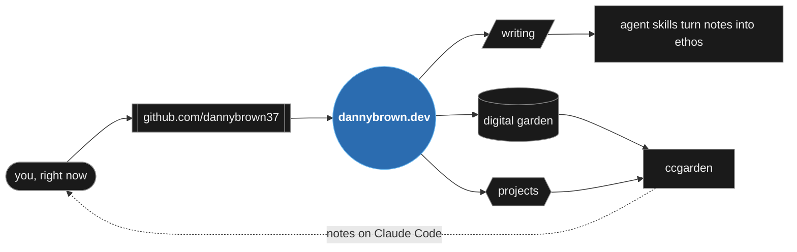

# Danny Brown

Software engineer. Billions of messages from thousands of vehicles, across two companies since 2021.

**[dannybrown.dev](https://dannybrown.dev)** — writing, projects, and the digital garden.

