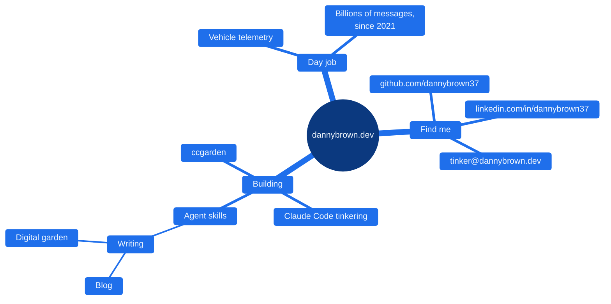

# Danny Brown

Software engineer. Billions of messages from thousands of vehicles, across two companies since 2021.

**[dannybrown.dev](https://dannybrown.dev)** — writing, projects, and the digital garden.

**Find me:** [GitHub](https://github.com/dannybrown37) · [LinkedIn](https://linkedin.com/in/dannybrown37) · [tinker@dannybrown.dev](mailto:tinker@dannybrown.dev)

- 🌱 [ccgarden](https://github.com/dannybrown37/ccgarden) — grow a tree/garden visualization from ccstats.db session history
- ✍️ [Blog](https://dannybrown.dev/blog) — writing on AI-assisted dev, mostly
