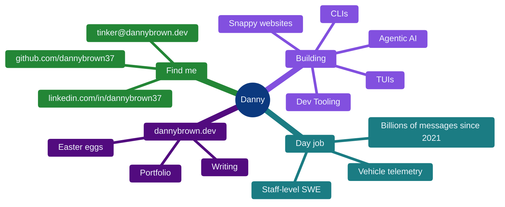

# Danny Brown

Software engineer.

```mermaid
%%{init: {'theme':'base', 'themeVariables': {
  'primaryColor':'#1f6feb','primaryTextColor':'#f0f6fc','primaryBorderColor':'#58a6ff',
  'lineColor':'#8b949e','textColor':'#f0f6fc','fontSize':'16px',
  'cScale0':'#1f6feb','cScale1':'#238636','cScale2':'#8250df','cScale3':'#1b7c83',
  'cScaleLabel0':'#f0f6fc','cScaleLabel1':'#f0f6fc','cScaleLabel2':'#f0f6fc','cScaleLabel3':'#f0f6fc'
}}}%%
mindmap
  root((Danny))
    Find me
      github.com/dannybrown37
      linkedin.com/in/dannybrown37
      tinker@dannybrown.dev
    Building
      CLIs
      TUIs
      Snappy websites
      Agentic AI
      Dev Tooling
    Day job
      Vehicle telemetry
      Billions of messages since 2021
      Staff-level SWE
    dannybrown.dev
      Writing
      Portfolio
      Easter eggs

```

**Find me:** [Portfolio](https://dannybrown.dev) · [GitHub](https://github.com/dannybrown37) · [LinkedIn](https://linkedin.com/in/dannybrown37) · [Email](mailto:tinker@dannybrown.dev)

